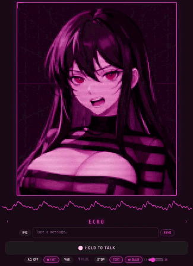
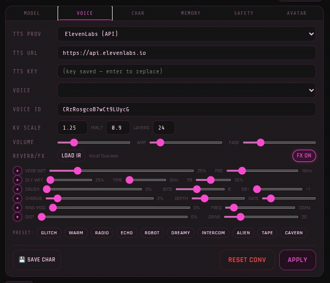
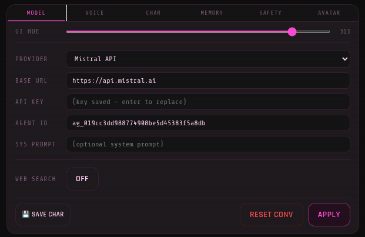
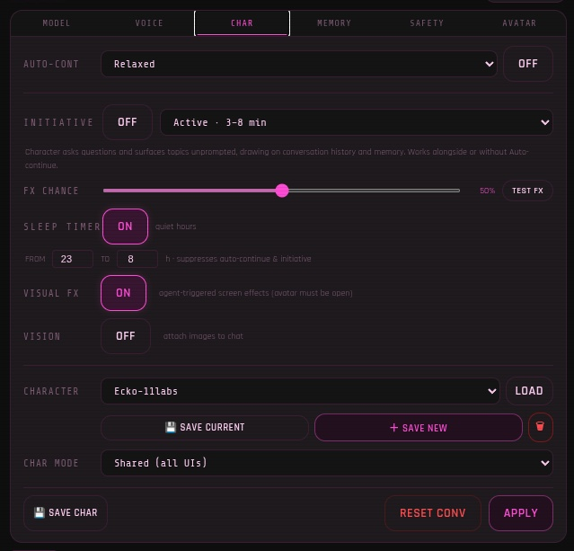
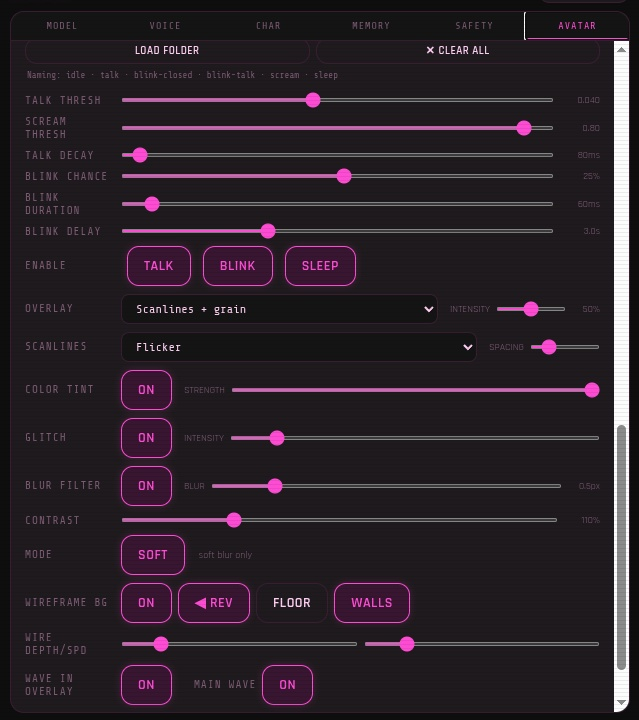
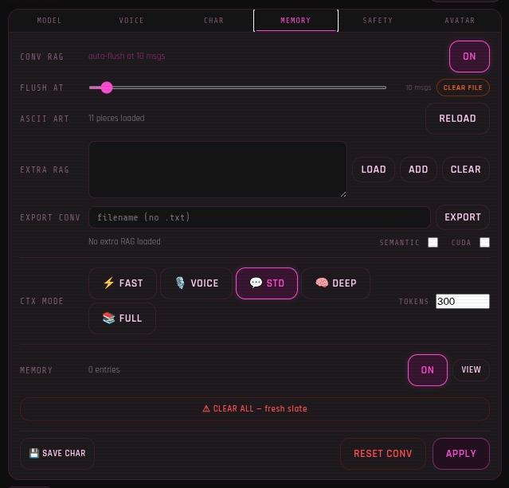
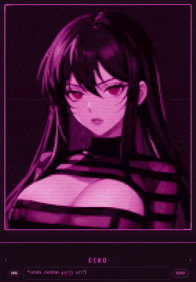
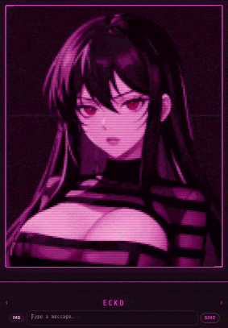
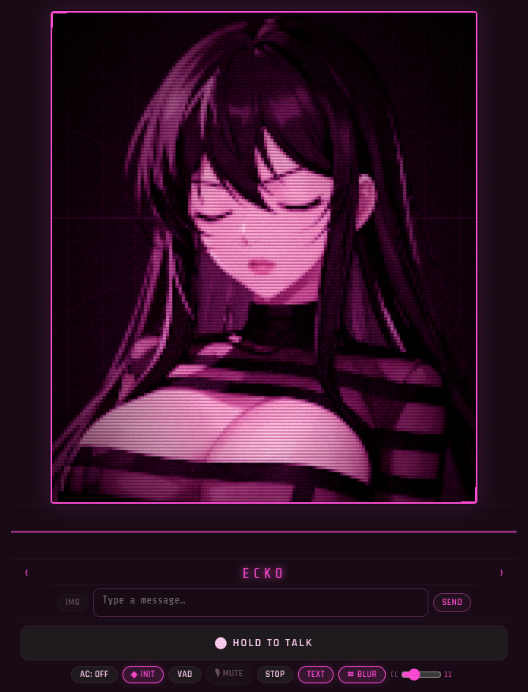

# ECKO



**ECKO** is a modular local AI companion system that combines:

* **LLM chat**
* **Streaming text-to-speech**
* **Speech-to-text**
* **Character personalities**
* **Persistent memory**
* **RAG knowledge retrieval**
* **Visual effects engine**
* **Web interface**

The goal of ECKO is to provide a **fast, self-hosted conversational AI experience** that runs entirely on your own machine while remaining highly customizable.

It started as a simple streaming TTS frontend and has evolved into a **complete conversational stack** with character systems, memory, knowledge retrieval, and a visual effects engine.

* Ecko is designed to work first and foremost with Echo TTS and KoboldCPP. I've been impressed with MistralAI's LLM API performance and other providers (LLM and TTS) are also being added for fallback, user choice and people without GPUs. Streaming audio may not be available under these configurations without paid subscription or even available at all. Ecko's intended low latency experience will take a hit but remain completely functional.

---

# Core Features

## Streaming Text-to-Speech



ECKO integrates with **Echo-TTS** for low-latency streaming voice playback.

* Exceptional audio quality
* Real-time streaming speech
* Character voice presets
* Volume and gain control
* Optional audio processing
* Convolution reverb with user customisable impulse response

Unlike most TTS frontends, audio playback begins **immediately while generation is still happening**.

---

## LLM Chat Integration



ECKO connects to a local LLM server such as:

* **KoboldCPP**
* any compatible API endpoint

Features include:

* Character-based system prompts
* Context management
* Auto-continue generation
* Conversation persistence
* Configurable generation settings

---

## Character System



ECKO supports **per-character configuration**, allowing each personality to define:

* System prompts
* Voice presets
* Memory behavior
* Audio settings
* Personality metadata
* Avatar images



Characters are stored locally and can be easily extended.

---

## Speech-to-Text

Voice interaction is supported through integrated STT.

Features:

* Push-to-talk input
* Live transcription
* Mic toggle support
* Designed for local inference engines

---

## Persistent Memory



ECKO includes a **long-term memory system**.

The assistant can store and retrieve information between conversations.

Memory types include:

* User facts
* Character notes
* Persistent conversation knowledge

All memory is stored locally.

---

## RAG Knowledge System

ECKO includes a **Retrieval Augmented Generation (RAG)** system.

This allows the assistant to reference external knowledge sources.

Knowledge sources can include:

* Conversation logs
* External text files
* Custom documents

RAG files are organized into:

```
rag/
 ├─ conversations/
 └─ extra/
```

---

## Visual Effects Engine


ECKO includes a full **canvas-based visual effects system** that fires on the avatar overlay. Effects are tinted to match the UI hue and run as animated canvas overlays above the avatar.

### Triggering Effects

Effects can be triggered in three ways:

**Agent reply tag** — the LLM can embed an effect tag in its response:
```
*fx: matrix_rain*
```
The tag is stripped from the displayed text and the effect fires silently.

**User command** — type in chat while the avatar overlay is open:
```
!fx               — random effect
!fx glitch        — specific effect
!fx list          — show all available effects
```

**Initiative auto-trigger** — effects fire automatically as part of the proactive messaging system (see Initiative below).

### Available Effects

| Command | Effect |
|---|---|
| `!fx matrix` | Matrix rain — Katakana/hex character cascade |
| `!fx glitch` | Glitch storm — horizontal tear bars |
| `!fx static` | Signal static — tinted TV noise burst |
| `!fx particles` | Particle burst — radial neon explosion |
| `!fx scanlines` | Scanline warp — CRT geometry distortion |
| `!fx corrupt` | Data corruption — block character cascade |
| `!fx heartbeat` | Heartbeat — EKG sweep with grid |
| `!fx hypno` | Hypno spiral — rotating colour rings |
| `!fx heart` | Heart pulse — beating heart |
| `!fx hearts` | Heart scatter — floating hearts |
| `!fx vhs` | VHS rewind — scan tears + RGB split |
| `!fx neural` | Neural fire — branching synapse arcs |
| `!fx melt` | Pixel melt — columns drip downward |
| `!fx void` | Void pulse — expanding dark rings |
| `!fx snap` | Static burst — sharp noise snap |
| `!fx cascade` | Cascade — slow deliberate column fall |
| `!fx bloom` | Chromatic bloom — aberration rings |
| `!fx crack` | Screen crack — fracture lines |
| `!fx flatline` | EKG flatline — flatline then spike |
| `!fx binary` | Binary rain — 1/0 character rain |
| `!fx warp` | Warp drive — hyperspace star streak |
| `!fx acid` | Acid wash — flowing colour bands |
| `!fx ghost` | Ghost signal — sine wave interference |
| `!fx memory` | Memory leak — hex block flicker |
| `!fx hologram` | Hologram — scan bars + corner brackets |
| `!fx shockwave` | Shockwave — expanding concentric rings |
| `!fx morse` | Morse — flash bar pattern |
| `!fx thermal` | Thermal vision — heat palette wash |
| `!fx digital` | Digital rain colour — block character rain |

Many effects also apply a temporary distortion to the avatar image layer (RGB split, desaturate, bloom etc.) that syncs with the canvas effect.

### Mood-Based Firing

The initiative system selects effects by mood category:

| Mood | Effects |
|---|---|
| `intense` | glitch storm, data corruption, static, static burst, screen crack, shockwave, EKG flatline |
| `mysterious` | matrix rain, hypno spiral, scanline warp, void pulse, ghost signal, hologram, morse |
| `playful` | particle burst, heartbeat, heart pulse, heart scatter, chromatic bloom, warp drive |
| `glitchy` | VHS rewind, pixel melt, memory leak, neural fire, binary rain, cascade, digital rain |
| `eerie` | void pulse, ghost signal, EKG flatline, thermal vision, acid wash, morse |

---

## Initiative System

ECKO's **initiative engine** drives proactive character behaviour — the character sends unprompted messages, fires visual effects, and generally acts as if it has its own inner life between user turns.

### Modes

* **Light** — occasional messages, long gaps
* **Standard** — regular engagement
* **Aggressive** — frequent, short intervals

### Openers

The character draws from a pool of opener types including:

* Conversation callbacks — references to recent exchanges
* Observations and opinions
* Follow-up questions
* Random thoughts and hot takes

### Creative Actions

A portion of initiative slots fire **creative display actions** rather than conversational openers:

* `*sends random ascii art*` — picks from the local ASCII art library
* `*sends favorite ascii art*` — picks from the local ASCII art library
* `*sends glitchy python message*` — LLM generates surreal Python code in the code panel
* `*sends a fake terminal status display*` — LLM generates a fake terminal readout
* `*runs a fake diagnostic on the conversation*` — LLM generates a diagnostic referencing recent topics
* `*sends a fake system scan readout*` — LLM generates a fake scan result
* `__FX:effect_name__` — fires a visual effect with no message

### FX Chance

A configurable percentage (0–100%) determines how often an initiative tick fires a visual effect instead of a message. Default is 15%.

### Sleep Timer

A configurable sleep window suppresses initiative and auto-continue firing between specified hours (e.g. 23:00–08:00).

---

## ASCII Art Library



ECKO includes a **local ASCII art library** that serves pre-made art pieces when the character would otherwise ask the LLM to generate ASCII art — avoiding token cost and poor quality LLM-generated output.

### File Format

Place `.txt` files in the `ascii_art/` directory. Each file is one piece, or use multiple pieces in one file separated by `---` on its own line:

```
  /\_/\
 ( o.o )
  > ^ <
---
 ________
| SYSTEM |
|________|
---
  __/\__
 /      \
```

### Loading

The library loads at startup. Use the **RELOAD** button in the MEMORY settings tab to hot-reload the directory without restarting the server.

### Triggering from Chat

Type either of these in chat to serve directly from the library (no LLM call):

```
*sends random ascii art*
*sends favorite ascii art*
```

---

## Code and Python Display



The avatar overlay includes a **code display panel** that renders fenced code blocks with a typewriter reveal effect. This is used for:

* `\`\`\`python` blocks — displayed with Python syntax highlighting style, typewriter effect
* `\`\`\`` plain blocks — used for terminal output, ASCII art, diagnostic readouts

The LLM is prompted via initiative creative actions to generate content specifically for this panel — fake terminal status displays, surreal Python, system diagnostics — making the code panel feel like a live system readout rather than just a chat feature.

---

## Web Interface

The application runs a **local web interface**.

This allows:

* Chat interaction
* Character selection
* Voice playback
* System configuration

The web server is launched from:

```
python ecko_web.py
```

Default port:

```
https://localhost:5050
```

---

## Web Search Integration

ECKO can optionally perform web searches to supplement responses when needed.

This allows the assistant to pull in **current information** outside the local knowledge base.

---

## Safety Layer

A configurable safety system helps control:

* Disallowed content
* Prompt filtering
* Output moderation

The system is fully local and customizable.

---

# Requirements

* **Python 3.11**
* Local **Echo-TTS API**
* Local **LLM server** (KoboldCPP recommended)
* External APIs now supported (MistralAI, Elevenlabs, Hume)

---

# Installation

## 1 Clone the repository

```
git clone https://github.com/ItsGeneralButtNaked/ecko
cd ecko
```

---

## 2 Create a virtual environment

### Conda

```
conda create -n ecko python=3.11
conda activate ecko
```

### Standard venv

```
python3.11 -m venv venv
source venv/bin/activate
```

---

## 3 Install dependencies

```
pip install --upgrade pip setuptools wheel
pip install -r requirements.txt
```

---

# Running ECKO

Start the server:

```
python ecko_web.py
```

Then open your browser:

```
https://localhost:5050
```

The interface will load the chat system.

---

# Required External Services

ECKO expects the following services to be running.

## Echo-TTS API

Streaming text-to-speech server:

https://github.com/KevinAHM/echo-tts-api

or compatible implementations.

---

## LLM Server

Recommended:

```
KoboldCPP
```

https://github.com/LostRuins/koboldcpp

---

# Configuration

Most runtime settings are automatically loaded from:

```
ecko_session.json
```

This stores:

* current character
* UI state
* conversation settings
* generation parameters

---

# Directory Structure

```
ecko/
 ├─ ascii_art/          ← ASCII art library files (.txt)
 ├─ characters/         ← Character JSON files
 ├─ memories/           ← Persistent memory storage
 ├─ rag/
 │   ├─ conversations/  ← Per-character conversation RAG
 │   └─ extra/          ← Manual RAG knowledge files
 ├─ safety/             ← Safety layer rules
 ├─ ssl/                ← Auto-generated TLS certificates
 ├─ logs/               ← Server logs
 └─ ecko_session.json   ← Runtime session state
```

---

# Platform Support

| Platform | Status                |
| -------- | --------------------- |
| Linux    | Fully supported       |
| Windows  | Fully Supported*      |
| MacOS    | Not officially tested |

\* ECKO works fine on Windows but Echo-TTS-API Docker container on Win10/11 is still being tested.

---

# Design Goals

ECKO focuses on:

* **Local-first AI**
* **Low latency and pristine quality audio (Echo-TTS)**
* **Character-driven interaction**
* **Simple extensibility**
* **Minimal external dependencies**

The system is intentionally modular so each component can evolve independently.

---

# Future Development

Future improvements include:

* Better documentation
* Test Echo-TTS-API Docker container on Windows for full Windows support
* ASCII art animation frames (flip-book style multi-frame display)
* Mini games in the code panel
* User-editable initiative and AC prompt pools
* ComfyUI workflows for avatar image creation
* Return of the native desktop app

---

# Known Issues

* Echo-TTS does have a couple of minor output issues in rare edge cases - shouty, podscast style snippets etc.
* Minor UI state issues - non critical but quick fixes so will be done soon.

---
# License

See repository license file.

---

# Acknowledgements

This project builds upon the work of several open-source communities:

* Echo-TTS https://github.com/jordandare/echo-tts
* Echo-TTS-API https://github.com/KevinAHM/echo-tts-api
* KoboldCPP https://github.com/LostRuins/koboldcpp
* PNGapp https://github.com/MarxyTV/pngapp
* Local LLM ecosystem

Without them this project would not exist.

Extra shoutout to the bigbrains in the OpenSesame Discord server - I literally wouldn't have even started slop without you guys both laughing at my initial noob stack and helping me with the odd nudge in the right direction :P

---



# Author

Created by **ItsGeneralButtNaked** as an experimental local AI interface.
